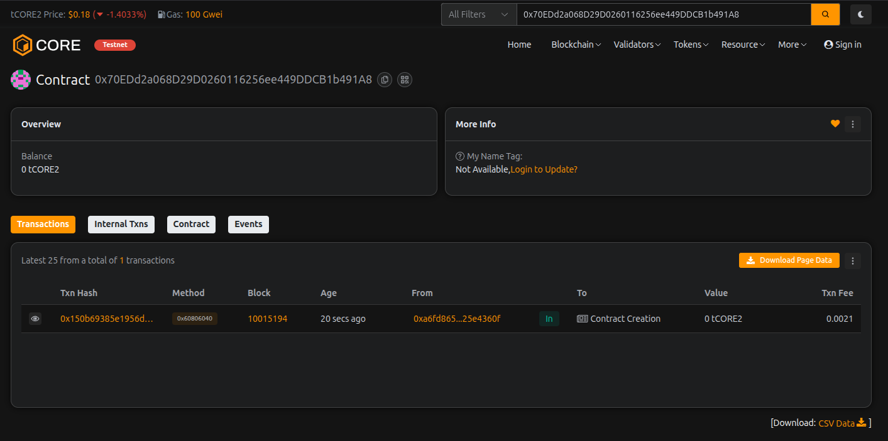

# TokenVerse Hub

---

## Project Description

TokenVerse Hub is a comprehensive decentralized platform built on blockchain technology that enables users to create, manage, and interact with multiple custom tokens within a unified ecosystem. This smart contract serves as a multi-token hub that combines token creation, transfer functionality, staking mechanisms, and reward distribution in a single, efficient platform.

The contract allows anyone to create their own tokens with custom names, symbols, and initial supply. Users can transfer these tokens, stake them to earn rewards, and participate in a vibrant token economy. TokenVerse Hub includes features for creator verification, flexible reward systems, and comprehensive token management capabilities.

---

## Project Vision

Our vision is to democratize token creation and management by providing an accessible, secure, and feature-rich platform where individuals and projects can launch and manage their tokens without the complexity of deploying separate smart contracts. TokenVerse Hub aims to be the go-to solution for:

- **Creators** looking to launch their own tokens for communities, projects, or businesses
- **Users** seeking opportunities to stake tokens and earn passive rewards
- **Communities** wanting a unified platform for managing multiple token economies
- **Developers** building on top of a reliable, auditable token infrastructure

We envision TokenVerse Hub as a catalyst for innovation in the decentralized economy, making token creation as simple as a few clicks while maintaining the security and transparency of blockchain technology.

---

## Key Features

1. **Multi-Token Creation**: Create unlimited custom tokens with unique names, symbols, and supply
2. **Token Transfers**: Secure peer-to-peer token transfers between addresses
3. **Staking System**: Stake tokens to earn rewards over time with automated calculation
4. **Reward Distribution**: Fair and transparent reward mechanism based on staking duration and amount
5. **Creator Verification**: Platform owner can verify trusted token creators
6. **Balance Tracking**: Real-time balance queries for all tokens and users
7. **Staking Dashboard**: View staked amounts and pending rewards at any time
8. **Flexible Reward Rates**: Adjustable reward rates to maintain economic sustainability
9. **Active Token Management**: Tokens can be managed and deactivated if needed
10. **Event Logging**: Comprehensive event emissions for all major actions

---

## Future Scope

1. **Governance Integration**: Implement DAO-style voting mechanisms for token holders
2. **Liquidity Pools**: Add automated market maker (AMM) functionality for token swapping
3. **NFT Integration**: Enable token-gated NFT minting and marketplace features
4. **Cross-Chain Bridge**: Support for token transfers across multiple blockchain networks
5. **Advanced Staking Tiers**: Multiple staking pools with different lock periods and reward multipliers
6. **Token Burning Mechanism**: Deflationary features for supply management
7. **Social Features**: User profiles, token rankings, and community engagement tools
8. **Mobile Application**: Dedicated mobile app for iOS and Android platforms
9. **Analytics Dashboard**: Comprehensive statistics and insights for token performance
10. **Partnership Programs**: Verified creator benefits and promotional opportunities
11. **Referral System**: Reward users for bringing new creators and participants to the platform
12. **Automated Airdrops**: Tools for token creators to distribute tokens to their communities

---

## Contract Details:

Transaction id: 0x70EDd2a068D29D0260116256ee449DDCB1b491A8
